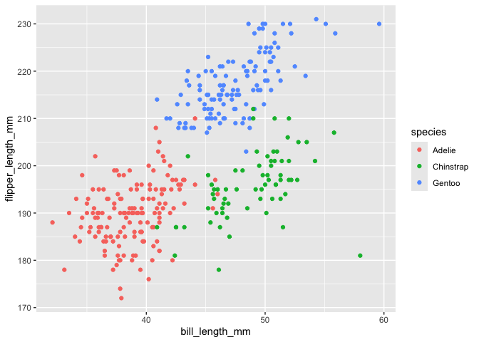

P8105 Homework 1
================
Yan Peng

``` r
library(tidyverse)
```

    ## ── Attaching core tidyverse packages ──────────────────────── tidyverse 2.0.0 ──
    ## ✔ dplyr     1.2.1     ✔ readr     2.2.0
    ## ✔ forcats   1.0.1     ✔ stringr   1.6.0
    ## ✔ ggplot2   4.0.3     ✔ tibble    3.3.1
    ## ✔ lubridate 1.9.5     ✔ tidyr     1.3.2
    ## ✔ purrr     1.2.2     
    ## ── Conflicts ────────────────────────────────────────── tidyverse_conflicts() ──
    ## ✖ dplyr::filter() masks stats::filter()
    ## ✖ dplyr::lag()    masks stats::lag()
    ## ℹ Use the conflicted package (<http://conflicted.r-lib.org/>) to force all conflicts to become errors

# Problem 1

``` r
data("penguins", package = "palmerpenguins")
```

The `penguins` dataset contains measurements of individual penguins.
Important variables include species, island, bill_length_mm,
bill_depth_mm, flipper_length_mm, body_mass_g, sex, year. The species
variable contains the values Adelie, Gentoo, Chinstrap. The `island`
variable contains the values Torgersen, Biscoe, Dream.

The dataset contains 344 rows and 8 columns.

The mean flipper length is 200.9152047 mm.

``` r
ggplot(
  penguins,
  aes(
    x = bill_length_mm,
    y = flipper_length_mm,
    color = species
  ) 
) + 
  geom_point(na.rm = TRUE)
```

<!-- -->

``` r
ggsave("penguins_scatterplot.png")
```

    ## Saving 7 x 5 in image

# Problem 2

``` r
set.seed(123)
df = tibble(
  normal_sample = rnorm(10),
  logical_vector = normal_sample > 0,
  character_vector =  c(
    "a","b","c","d","e",
    "f","g","h","i","j"
  ),
  factor_vector = factor(
    c(
      "low","medium","high",
      "low","medium","high",
      "low","medium","high",
      "low"
    )
  )
)
```

``` r
mean(pull(df, normal_sample))
```

    ## [1] 0.07462564

``` r
mean(pull(df, logical_vector))
```

    ## [1] 0.5

``` r
mean(pull(df, character_vector))
```

    ## Warning in mean.default(pull(df, character_vector)): argument is not numeric or
    ## logical: returning NA

    ## [1] NA

``` r
mean(pull(df, factor_vector))
```

    ## Warning in mean.default(pull(df, factor_vector)): argument is not numeric or
    ## logical: returning NA

    ## [1] NA

For numerical and logical variables, mean value can be calculated while
mean value of character vector and factor vector can’t.

``` r
as.numeric(df$logical_vector)
as.numeric(df$character_vector)
as.numeric(df$factor_vector)
```

Applying `as.numeric()` to the logical variable converts `TRUE` to 1 and
`FALSE` to 0 because R can coerce logical values into numeric values for
arithmetic operations. This explains why taking the mean of a logical
vector works.

Applying `as.numeric()` to the character variable produces `NA` values
because strings such as `"a"` and `"b"` do not contain numeric
information that R can interpret as numbers. Since `mean()` requires
numeric or logical input, it cannot calculate a meaningful mean for this
character vector.

Applying `as.numeric()` to the factor variable returns the internal
integer codes corresponding to the factor levels because factors are
stored internally using integer codes with labels attached to them. In
this case, the levels are ordered as `"high"`, `"low"`, and `"medium"`,
so they are coded as 1, 2, and 3, respectively. These numbers represent
category labels rather than quantitative measurements, so calculating
their mean would not be meaningful.

Therefore, coercion helps explain why `mean()` works for logical
variables but not directly for character or factor variables.
